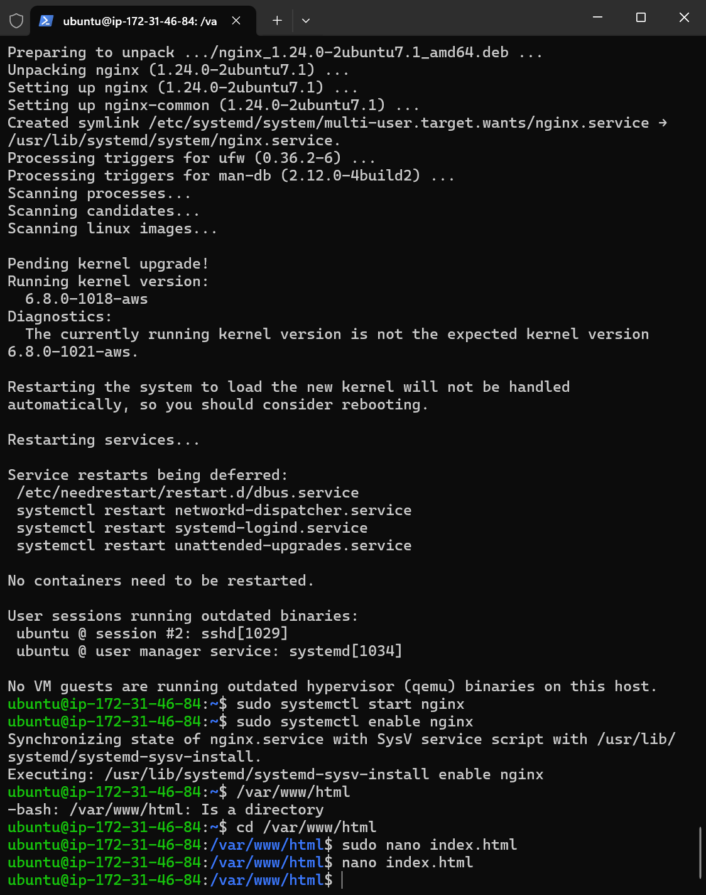
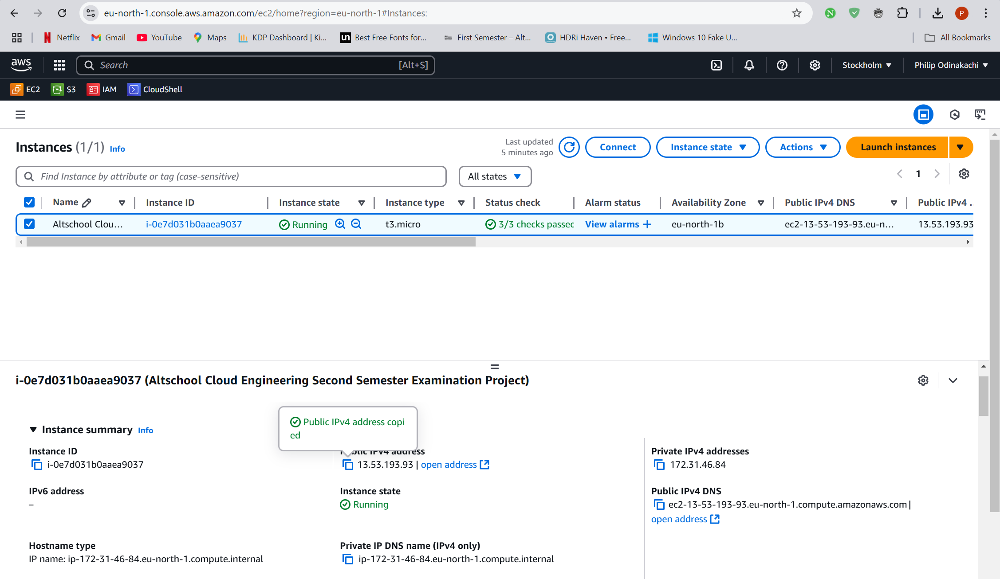

# Cloud Engineering Second Semester Examination Web Server Project

## Public IP Address
- HTTP: [http://13.53.193.93]
- HTTPS:  [https://philodlanding.ddns.net/]

## Description
This project demonstrates how to:
1. Provision a Linux server on a cloud platform.
2. Install and configure a web server (Apache or Nginx).
3. Deploy a simple HTML landing page.

The landing page includes:
- A project title: "Welcome to Philip Odinakachi's Landing Page."
- A brief description of my project.
- My full bio with interesting details about me.

## How to Access the Web Server
1. Visit the HTTP link: [http://13.53.193.93]
2. Visit the HTTPS link: [https://philodlanding.ddns.net/]

## Setup Instructions
To replicate this project:

### Step 1: Set Up Your Cloud Environment
#### Sign up for a Cloud Provider:
- Create an account on a cloud platform like AWS, Google Cloud Platform (GCP), or Microsoft Azure. I used AWS.
- Create a Virtual Machine (VM):

#### Log into the AWS Management Console.
- Go to the EC2 Dashboard (search for "EC2" in the search bar).
- Click Launch Instance to create a virtual machine.
- Choose an Amazon Machine Image (AMI):
  - Select Ubuntu Server 22.04 LTS (or another version of Ubuntu).
- Select an instance type:
  - For simplicity, choose t2.micro (eligible for free tier).
- Configure security settings:
  - Create a new Security Group with the following rules:
    - Allow HTTP (port 80).
    - Allow SSH (port 22) for connecting to your server.
- Launch the instance and download the private key file (.pem) for SSH access.

### Step 2: Connect to Your Server
- Open a terminal on your computer.
- Navigate to the folder containing the .pem key file.
- Connect using SSH: ssh -i your-key.pem ubuntu@your-ec2-public-ip
Replace your-key.pem with the key file name and your-ec2-public-ip with the public IP address of your instance (find this in the EC2 Dashboard).

### Step 3: Install and Configure a Web Server
- Update the system: sudo apt update && sudo apt upgrade -y
- Install Nginx: sudo apt install nginx -y
- Start and enable the web server: sudo systemctl start nginx
sudo systemctl enable nginx
- Verify the server is running: Open a browser and navigate to your public IP address. You should see the default Apache/Nginx welcome page.

### Step 4: Create and Deploy the HTML Page
#### Create an HTML file:
- Navigate to the default web server directory: /var/www/html
- Create a new HTML file: sudo nano /var/www/html/index.html
- Write your HTML content. Press Ctrl+O, then ENTER to save. Press Ctrl+X to exit the editor.
- Test your page: Open a browser and enter your public IP address to see your page.

### Step 5: Configure Networking
- Ensure HTTP traffic is allowed:
  - Go back to the AWS Management Console.
  - Check your Security Group rules under the EC2 instance details.
  - Ensure there’s a rule allowing inbound traffic on port 80 (HTTP).
- Access your page from any device:
  - Share your public IP address (or URL if you set up DNS) with others.
  - Example: http://<your-public-ip>

### Step 6: Configure HTTPS with Let's Encrypt
- Get a Free Domain Name (Recommended for Learning Purposes)
  - Use a free domain provider like Freenom to register a free domain. Example: example.tk or example.ml.
  - Point this domain to your server's public IP address using a DNS record.
- Use a Subdomain from a Free Service:
  - Use a free dynamic DNS provider like No-IP or DuckDNS. They let you create a free subdomain like yourname.no-ip.org or yourname.duckdns.org.
  - Update the subdomain’s DNS record to point to your server’s public IP.
- Install Certbot: sudo apt install certbot python3-certbot-nginx -y
- Obtain an SSL Certificate: sudo certbot --nginx
- Follow the prompts:
  - Enter your email address.
  - Agree to the terms of service.
  - Certbot will handle certificate generation and web server configuration.
- Verify HTTPS:
  - Visit your server in a browser using https://<your-public-ip> (or domain if configured).
  - You should see the HTTPS version of your site.
- Set Up Auto-Renewal:
  - Add a cron job to renew certificates automatically: sudo crontab -e
  - Add the following line to renew certificates daily: 0 3 * * * certbot renew --quiet

## Screenshots
Here are some screenshots of the project setup:
1. **Web Server Installation**:
   

2. **EC2 Instance Running**:
   

3. **Landing Page**:
   

## Tools Used
- **Cloud Platform**: AWS EC2
- **Operating System**: Ubuntu 22.04 LTS
- **Web Server**: Nginx
- **SSL Configuration**: Let's Encrypt

## Troubleshooting
- If the web server is not accessible:
  - Check your instance's public IP and security group rules.
  - Ensure port 80 is open for HTTP traffic.
  - Restart the web server: `sudo systemctl restart apache2` (or `nginx`).

- For SSL issues:
  - Verify the certificate installation with: `sudo certbot renew --dry-run`.

## Author
**Philip Odinakachi**  
phodinakachi@gmail.com  

---

