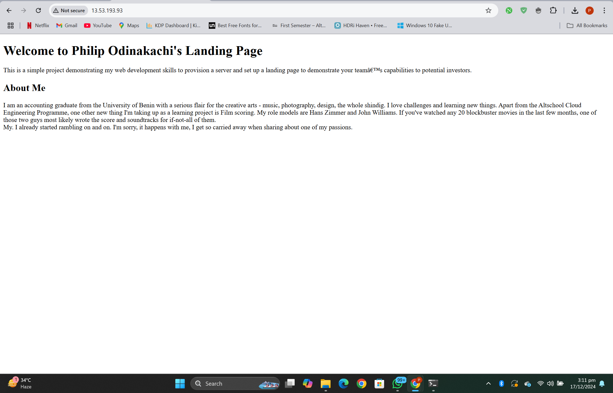

# Cloud Engineering Second Semester Examination Web Server Project

## Public IP Address
- HTTP: [http://13.53.193.93]

## Description
This project demonstrates how to:
1. Provision a Linux server on a cloud platform.
2. Install and configure a web server (Apache or Nginx).
3. Deploy a simple HTML landing page.

The landing page includes:
- A project title: "Welcome to Philip Odinakachi's Landing Page."
- A brief description of my project.
- My full bio with interesting details about me.

## How to Access the Web Server
1. Visit the HTTP link: [http://13.53.193.93]

## Setup Instructions
To replicate this project:
1. **Provision a Server**:
   - Use AWS, Google Cloud, or any virtualization platform (I used AWS).
   - Install Ubuntu 22.04 LTS or a similar Linux distribution.

2. **Install a Web Server**:
   - Install Apache using the command: `sudo apt install apache2 -y`
   - (My choice) Install Nginx: `sudo apt install nginx -y`

3. **Deploy an HTML Page**:
   - Place the HTML file in the default web server directory (`/var/www/html`).

4. **Enable Networking**:
   - Open port 80 for HTTP traffic.
   - (Optional) Configure HTTPS with Let’s Encrypt (Couldn't do this because I don't have a domain name for my page yet).

## Screenshots
Here are some screenshots of the project setup:
1. **Web Server Installation**:
   

2. **EC2 Instance Running**:
   

3. **Landing Page**:
   

## Tools Used
- **Cloud Platform**: AWS EC2
- **Operating System**: Ubuntu 22.04 LTS
- **Web Server**: Nginx

## Troubleshooting
- If the web server is not accessible:
  - Check your instance's public IP and security group rules.
  - Ensure port 80 is open for HTTP traffic.
  - Restart the web server: `sudo systemctl restart apache2` (or `nginx`).

- For SSL issues:
  - Verify the certificate installation with: `sudo certbot renew --dry-run`.

## Author
**Philip Odinakachi**  
phodinakachi@gmail.com  

---

